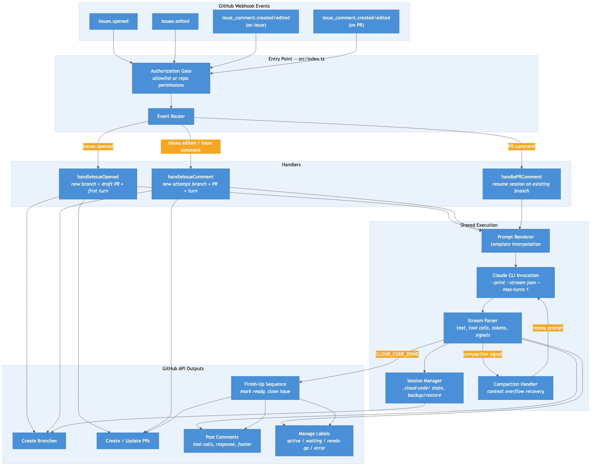

# System Design

Cloud Code is a GitHub Action that converts issues into pull requests by running autonomous Claude Code sessions inside GitHub Actions runners.

## Overview

The action listens for GitHub webhook events on issues and comments. When triggered, it creates a branch and draft PR, runs the Claude Code CLI to generate code changes, and posts results back to the PR. The entire lifecycle -- from issue creation to a reviewable PR -- runs without human intervention.

The codebase is TypeScript, compiled with `ncc` into a single `dist/index.js` that GitHub Actions executes directly. It uses `@actions/core` and `@actions/github` for Actions integration and Octokit for GitHub API calls.

## Event Model

The workflow subscribes to four event types:

| Event | Trigger |
|---|---|
| `issues.opened` | Someone creates a new issue |
| `issues.edited` | Someone edits an existing issue's title or body |
| `issue_comment.created` | Someone posts a comment on an issue or PR |
| `issue_comment.edited` | Someone edits an existing comment on an issue or PR |

GitHub's API treats pull requests as a special kind of issue, so `issue_comment` events fire for both. The action distinguishes them by checking whether `payload.issue.pull_request` exists.

### Event Routing

The entry point (`src/index.ts`) performs authorization checks, then routes each event to the appropriate handler:

- **`issues.opened`** -> `handleIssueOpened` -- creates a fresh branch, draft PR, and runs the first Claude Code turn.
- **`issues.edited`** -> `handleIssueComment` -- treats the updated issue body as a new attempt (new branch, new PR), since a branch from the original `opened` event may already exist.
- **`issue_comment.created` or `edited` on an issue** -> `handleIssueComment` -- creates a new attempt branch to address the comment.
- **`issue_comment.created` or `edited` on a PR** -> `handlePRComment` -- resumes the existing session on the PR's branch.

## Authorization

Every event is checked against an authorization gate before routing. Two modes are supported:

1. **Explicit allowlist** -- if `allowed_users` is configured (comma-separated usernames), only those users can trigger runs.
2. **Repository permission fallback** -- if no allowlist is set, the action checks whether the sender has `write` or `admin` access via the collaborator permission endpoint.

Bot accounts (`github-actions[bot]`, `cloud-code[bot]`) are always skipped to prevent infinite loops.

## Concurrency

The workflow uses GitHub's built-in concurrency control:

```yaml
concurrency:
  group: cloud-code-${{ github.event.issue.number }}
  cancel-in-progress: false
```

Only one run executes per issue at a time. `cancel-in-progress: false` queues new events rather than canceling the active run.

## Branch and PR Strategy

Handlers that start a new session follow the same sequence:

1. **Resolve the default branch** (e.g., `main`) and get its HEAD SHA via the Git References API.
2. **Generate a branch name** as `cloud-code/issue-{N}-{slug}`, where the slug is a truncated, lowercased, hyphenated version of the issue title. Repeat attempts on the same issue get a numeric suffix (`-2`, `-3`, etc.) by scanning existing refs.
3. **Create the branch** via the Git References API (`POST /repos/{owner}/{repo}/git/refs`).
4. **Checkout the branch** locally in the Actions runner with `git fetch` + `git checkout`.
5. **Create a draft PR** via the Pulls API, linking it to the issue.

The PR starts as a draft to avoid premature reviewer notifications. It converts to "ready for review" after Claude signals completion.

## Prompt System

### Template Rendering

Prompts use mustache-style `{{variable}}` interpolation. The template engine resolves dot-separated paths against a `TemplateVars` object:

```
{{issue.number}}     →  42
{{issue.title}}      →  "Fix login timeout"
{{issue.body}}       →  the full issue description
{{issue.labels}}     →  "bug, auth"
{{issue.author}}     →  "octocat"
{{issue.comments}}   →  formatted thread of comments from allowed users
{{repo.name}}        →  "my-app"
{{repo.full_name}}   →  "octocat/my-app"
{{comment.body}}     →  the triggering comment text
```

Users can supply a custom template via the `prompt_template` action input. The default template instructs Claude to read project documentation, assess the issue, propose a plan, implement it, and signal completion.

### Issue Comment Interpolation

The action fetches all comments on the issue via `GET /repos/{owner}/{repo}/issues/{number}/comments`. Comments are filtered to authorized users only (same allowlist/write-access logic as the main gate), and bot comments are excluded. The result is formatted as a chronological thread:

```
alice: 2026-03-15T10:30:00Z
Can you also handle the edge case where the session expires?

bob: 2026-03-15T11:00:00Z
+1, and make sure to add tests for that path.
```

This populates `{{issue.comments}}` in prompt templates.

### Completion Signal

The prompt instructs Claude to emit the literal string `CLOUD_CODE_DONE` when it considers the work complete. The action scans output for this signal to trigger the finish-up sequence.

## Session Management

Each run maintains state in a `.cloud-code/` directory on the branch. This directory is force-added to git (it's in `.gitignore` for normal development) so it persists across workflow runs.

### Session State

`session.json` tracks:

- **Session ID** -- the CLI session identifier, used to resume conversations.
- **Status** -- one of `starting`, `active`, `waiting`, `done`, `error`, or `compacted`.
- **Turn count** -- number of human + assistant turns completed.
- **Context usage** -- tokens used vs. available, for monitoring context limits.
- **PR and issue numbers** -- cross-references for the finish-up sequence.

### Turn Logging

Every turn is written to `.cloud-code/turns/` as numbered Markdown files (`001-human.md`, `002-assistant.md`, etc.). Tool calls from assistant turns are saved as separate JSON files (`002-tools.json`). These logs are included in the PR description when the agent finishes, and replayed into the prompt if compaction occurs.

### Session Backup and Restore

The CLI maintains its own conversation state in `~/.claude/` on the runner filesystem. Since each GitHub Actions job starts with a clean runner, this state must be preserved between turns:

- **Backup**: after each turn, `.claude/` is tar'd (excluding auth credentials) and saved to `.cloud-code/claude-session.tar.gz` on the branch.
- **Restore**: on PR comment events (which resume a session), the tarball is extracted to `~/.claude/` before running `--resume {sessionId}`.

Auth credentials are handled separately -- restored from the `claude_credentials` secret at the start of every run, before the session restore. This ensures credentials never get committed to a branch.

## Claude Code Execution

The action invokes the CLI as a subprocess:

```
claude --print --output-format stream-json --model {model} --max-turns 1 {prompt}
```

Key flags:
- `--print` runs in non-interactive mode.
- `--output-format stream-json` produces newline-delimited JSON, parsed for text content, tool calls, token usage, session ID, and the completion signal.
- `--max-turns 1` limits Claude to a single agent turn per workflow run. Multi-turn work spans multiple runs, resumed via PR comments.
- `--resume {sessionId}` continues a previous conversation (for PR comment events).

### Stream Parsing

The JSON stream contains several message types:

- `system`/`init` -- session ID.
- `assistant`/`message` -- text blocks and tool use blocks (tool name, input, ID).
- `tool_result` -- tool outputs, matched to tool uses by ID.
- `result` -- final summary with cost, duration, and error status.

The parser also watches for compaction signals (`system` message with subtype `compaction`).

### Compaction Handling

When Claude hits context limits mid-turn, the action detects the compaction signal and runs a recovery sequence:

1. Mark the current session as `compacted`.
2. Read all stored turns from `.cloud-code/turns/`.
3. Build a replay prompt containing the full conversation history.
4. Start a fresh Claude session with an expanded context window (`fallback_max_context`, default 1M tokens).

The new session loses the original conversation's internal state but retains the full text history.

## Finish-Up Sequence

When Claude's output contains `CLOUD_CODE_DONE`, the action runs:

1. **Extract the summary** -- everything after the `CLOUD_CODE_DONE` signal in Claude's output.
2. **Generate a diff summary** -- `git diff --stat` between the PR branch and the base branch.
3. **Build a session log** -- all turns concatenated into a Markdown document.
4. **Update the PR description** -- replaces the placeholder body with a structured summary including changes, testing notes, and a collapsible session log. Includes `Fixes #N` to auto-close the issue on merge.
5. **Mark the PR ready for review** -- uses the GraphQL `markPullRequestReadyForReview` mutation (the REST API doesn't support removing draft status).
6. **Post an issue comment** -- notifies the issue thread that the PR is ready.

## Label Management

Four labels communicate status:

| Label | Meaning | Set when |
|---|---|---|
| `cloud-code:active` | Session in progress | A handler starts work |
| `cloud-code:waiting` | Awaiting user input | A turn completes without `CLOUD_CODE_DONE` |
| `cloud-code:needs-qa` | PR ready for review | The finish-up sequence completes |
| `cloud-code:error` | Something went wrong | An unrecoverable error occurs |

Labels are mutually exclusive -- setting one removes all others. The action auto-creates them (with colors and descriptions) if they don't exist in the repository.

## PR Comment Formatting

After each turn, the action posts a PR comment with:

1. **Tool calls** -- a collapsible `<details>` section listing each tool invocation (command, file path, or pattern) with truncated output.
2. **Response text** -- Claude's text output.
3. **Context footer** -- token usage, model name, and a truncated session ID for debugging.

## Architecture



## Source Layout

```
src/
  index.ts                  Entry point: event routing and authorization
  handlers/
    issue-opened.ts         New issue → new branch + PR + first turn
    issue-comment.ts        Issue comment → new attempt branch + PR + turn
    pr-comment.ts           PR comment → resume session + turn
    common.ts               Shared config loading and turn execution
  github/
    api.ts                  Octokit client, default branch, permission checks
    branch.ts               Branch naming, creation, git operations
    pr.ts                   PR creation, updates, ready-for-review mutation
    labels.ts               Label CRUD and status management
    comments.ts             Comment posting and filtered fetching
  harness/
    runner.ts               Claude CLI invocation and stream parsing
    session.ts              Session state persistence (.cloud-code/)
    turn-logger.ts          Turn file I/O and session log building
    compaction.ts           Context overflow recovery
  prompt/
    template.ts             Mustache-style template renderer
    defaults.ts             Default prompt template and completion signal
  utils/
    format-comment.ts       PR comment formatting (tool calls, footer)
    context-tracker.ts      Token usage tracking and display
    slugify.ts              Branch name slug generation
```
